<div align="center">

[](https://github.com/ChristopherJoshy/TRAE)

[](https://github.com/ChristopherJoshy/TRAE/actions)
[](https://nodejs.org)
[](apps/web)
[](contracts/TraceAnchor.sol)
[](https://sepolia.etherscan.io/address/0x2409511ac5650ac3ff620dd0dc1345d658ee4401#readContract)
[](#-quick-start)
[](#-known-limitations-short-version--full-text-in-docslimitationsmd)

**HH Goa 2026 · Shortlisting Task 3: Face Identification & Blockchain Verification**

Give TRACE a face scan. It finds genuinely matching web/social posts, seals the evidence with a
SHA-256 fingerprint, anchors that fingerprint on an Ethereum chain, and re-verifies it on-chain.
If it can't confirm a real match, it says so and stops — **it never invents results**.

[](https://github.com/ChristopherJoshy/TRAE)

</div>

<div align="center">
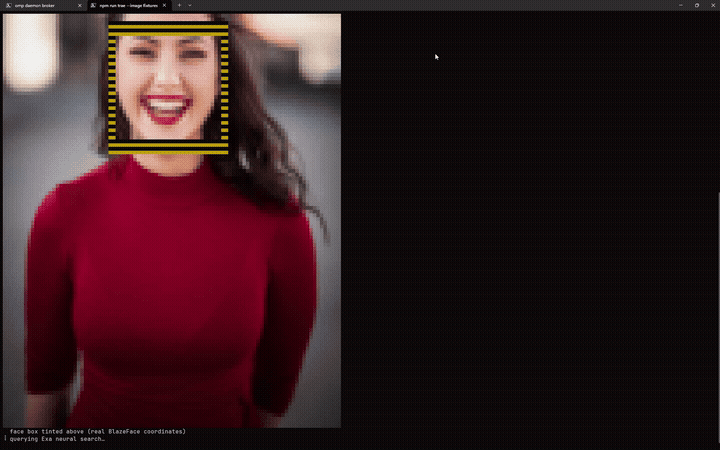
<br/><em>◉ live match review — the 0.992 portrait, face-box overlaid, straight from the demo film ↓</em>
</div>

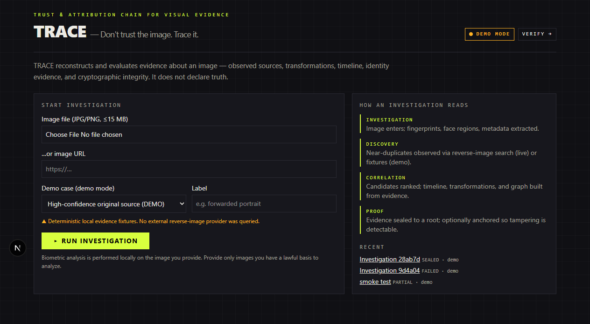

---

## In plain words: what happens when you run it?

Imagine someone forwards you a photo and asks *"where is this from?"* TRACE does the detective work:

1. **It looks at the face** — finds it in the photo, learns what it looks like (as numbers, kept only
   in memory, never saved).
2. **It searches the web** — a live neural search (Exa) plus free helpers (Reddit, GitHub) find pages
   that might contain the same picture.
3. **It compares, for real** — every candidate image is downloaded and measured against yours with
   perceptual hashing. Close-but-unsure cases get a second opinion: face-to-face comparison.
4. **It seals the findings** — everything observed is written into one canonical record and hashed
   into a single **Evidence Root** (`0x…`). Change one character of the record and the root changes.
5. **It anchors the seal on a blockchain** — the root (and only the root — never your photo, never
   face data, never names) is written into a smart contract, `TraceAnchor.sol`.
6. **It double-checks** — it reads the chain back and confirms the anchor, the event log, and the
   root all agree. Only then does it declare success.

And if step 3 finds nothing convincing? The pipeline prints
`No matching post confirmed — pipeline stops rather than inventing one` and exits with an error.
An honest dead end beats a confident lie.

---

## The pipeline, phase by phase

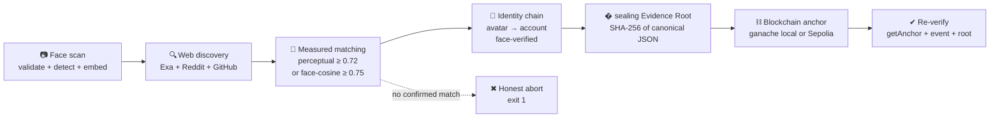

| # | Phase | What it does (human version) | Under the hood |
|---|-------|------------------------------|----------------|
| 1 | **Face scan** | Checks your file is really an image, finds the face, memorizes its features. | Magic-byte + 15 MB + pixel-budget validation; MediaPipe BlazeFace (headless Chromium) detects; MobileNetV3 embedder makes a 1024-dim vector, memory-only. |
| 2 | **Web discovery** | Searches the internet for pages showing the same picture. | Exa `/search` (ID-token + context queries, platform pass: GitHub/Instagram/X/LinkedIn/TikTok/Facebook/Reddit/Pinterest) + `/contents`; free legs: Reddit PullPush, GitHub avatar→profile. |
| 3 | **Measured matching** | Downloads each candidate picture and scores how similar it is to yours. | SSRF-gated fetch; windowed-containment perceptual similarity, threshold **0.72** (same image ≈1.0, strangers ≈0.47). Mid-band 0.40–0.72 → face verification: re-detect + embed, cosine ≥ **0.75** (same face ≈0.88, others ≈0.41). |
| 3b | **Identity chain** | If a match names a person, checks their other avatars really are the same face. | GitHub user search; every extra avatar face-verified before it counts; same-name strangers rejected by embedding distance. |
| 4 | **Seal** | Writes one tidy evidence record and fingerprints it. | Canonical JSON (sorted keys, NFC strings, 6-decimal numbers) → SHA-256 **Evidence Root** (`packages/shared/src/canonical.ts`). |
| 5 | **Anchor** | Publishes the fingerprint to a blockchain. | `solc`-compiled `contracts/TraceAnchor.sol`, deployed + called via `viem`; local ganache (chain 1337) by default, Sepolia testnet with `--chain sepolia`. |
| 6 | **Re-verify** | Reads the chain back and proves the anchor is really there. | `getAnchor` + `verifyAnchor` + `EvidenceAnchored` event count; mismatch throws. |

---

## System architecture

Two ways to use TRACE share one Suhail of typed primitives (`packages/shared/`):

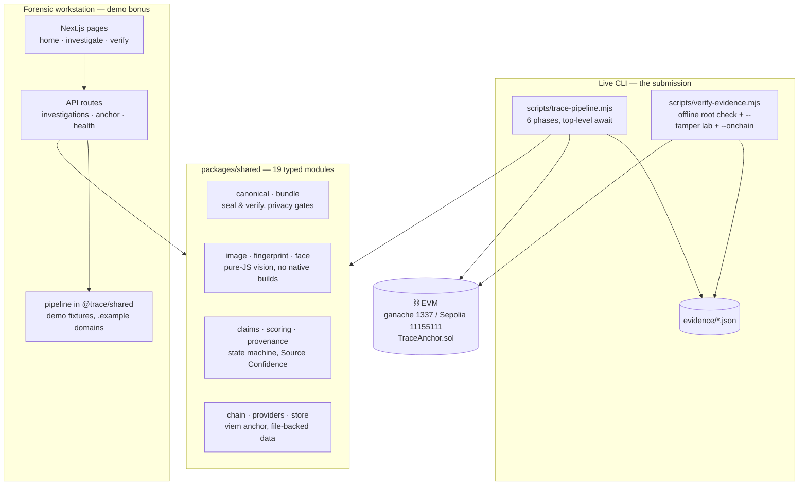

**Why this shape?** One server, no Python, no database server, no native image libraries
(OpenCV/dlib can't reliably build on a judge's Windows machine in judging time). Vision is pure JS
(`jpeg-js`/`pngjs`); the face module exposes a narrow `analyzeFaces` interface so a stronger model
can replace the baseline without touching callers. Investigations persist as JSON files; raw bytes
are content-addressed. Every external leg has coded errors and degrades honestly (`PARTIAL`) or aborts.

---

## Quick start

### A. Web workstation — the 60-second judge path (demo mode, no keys)

```bash
npm install
npm run dev        # http://localhost:3000, TRACE_MODE=demo
```

1. Keep `case-b`, attach any portrait (or none — a fixture is used), press **RUN INVESTIGATION**.
2. **PEEL THE IMAGE**: click layers 1→8 (source → face map → fingerprint → metadata → copies → transformations → graph → root).
3. **PROVENANCE CONSTELLATION**: click nodes, hover edges for confidence + evidence.
4. **SIMILARITY LENS**: pick candidates, toggle Overlay, read WHY / DIFFERENCES.
5. **TEMPORAL TRACE**: scrub the timeline; lens + graph follow.
6. **TRACE SEAL**: press **Verify integrity** → `EVIDENCE INTEGRITY VERIFIED`.
7. Tamper lab: open `/verify`, verify by id (MATCH), then paste the bundle with one edited field → `FAILED — EVIDENCE MODIFIED`.

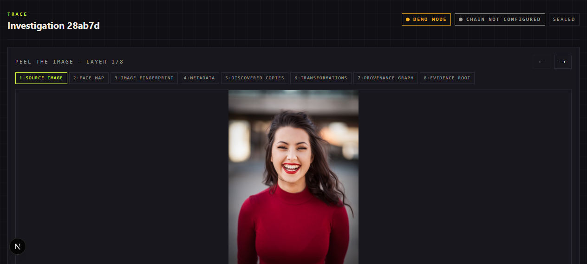

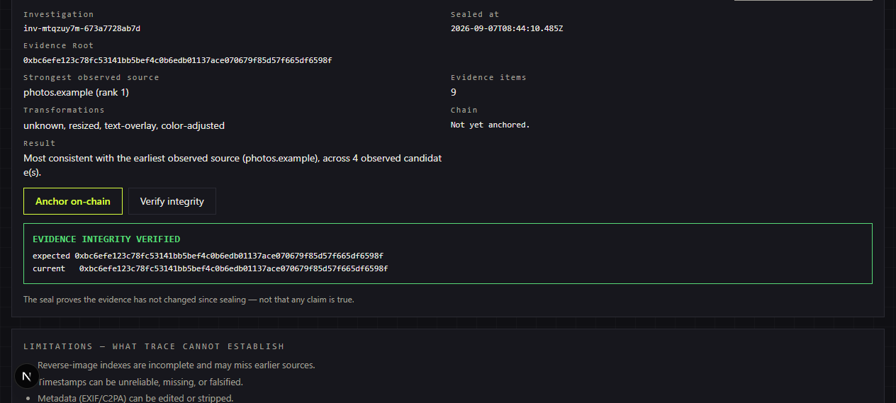

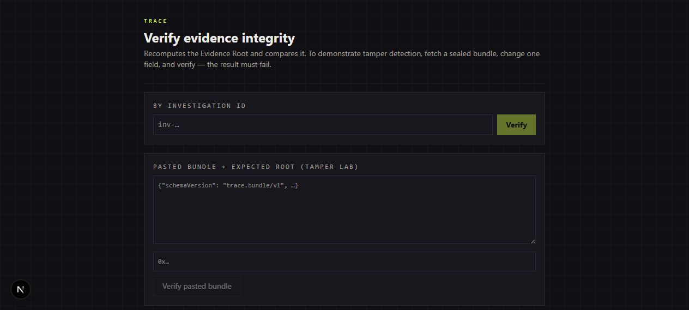

Demo cases: `case-a` exact origin · `case-b` propagation chain (default) · `case-c` impersonation pattern ·
`case-d` ambiguous, no forced answer · `case-e` provider failure, sealed anyway. All demo content uses
`.example` domains and fictional handles, and never touches the network. Full script: `docs/DEMO.md`.

### B. Live CLI — the real thing (needs `EXA_API_KEY` in `.env`)

```bash
npm install
node scripts/trace-pipeline.mjs --image fixtures/real/portrait-woman.jpg --out evidence.json
# or: --image-url "https://<public face photo>" [--chain sepolia]
node scripts/verify-evidence.mjs --evidence evidence.json            # offline root recompute
node scripts/verify-evidence.mjs --evidence evidence.json --tamper   # proves tampering is caught
node scripts/verify-evidence.mjs --evidence evidence.json --onchain  # re-queries Sepolia, no key needed
```

A real run looks like this (Sept 2026, Sepolia, 82 s end-to-end):

```
 ━━━ [6/6] BLOCKCHAIN ANCHOR ━━━━━━━━━━━━━━━━━━━━━━━━━━━━━
 ✔ anchored tx 0xafc9eba879124bd8… (block 11653012)
 ✔ EVIDENCE ANCHORED & VERIFIED  (82s)  → evidence-test.json

  ◈ PROVENANCE TRACE
  ├─ ◉ face scan — 1 face(s), best score 0.938 [BlazeFace, 85ms]
  ├─ ◉ web discovery — 26 pages [Exa, 1380ms]
  │ └─ ★ MATCH www.glbgpt.com ██████████████████ 0.992
  ├─ ◉ seal — 0x131347155b461aaa…35e729f
  └─ ⛓ chain — sepolia-testnet (chain 11155111)
     ├─ contract 0x2409511ac5650ac3ff620dd0dc1345d658ee4401 (block 11653011)
     ├─ anchor tx 0xafc9eba879124bd8… (block 11653012)
     └─ re-verified: exists=true anchored=true events=1
```

---

## Demo video — the run, narrated (100 seconds)

`media/TRACE-3-demo-narration.mp4` — a screen recording of the live Sepolia run above, with an
English voiceover and no baked-in captions (a `.en.srt` sidecar ships alongside for YouTube's
caption track). The file lives under gitignored `media/` (video never enters git) — upload it
**unlisted** to YouTube/Drive/Loom and submit the link. What the narration walks through:

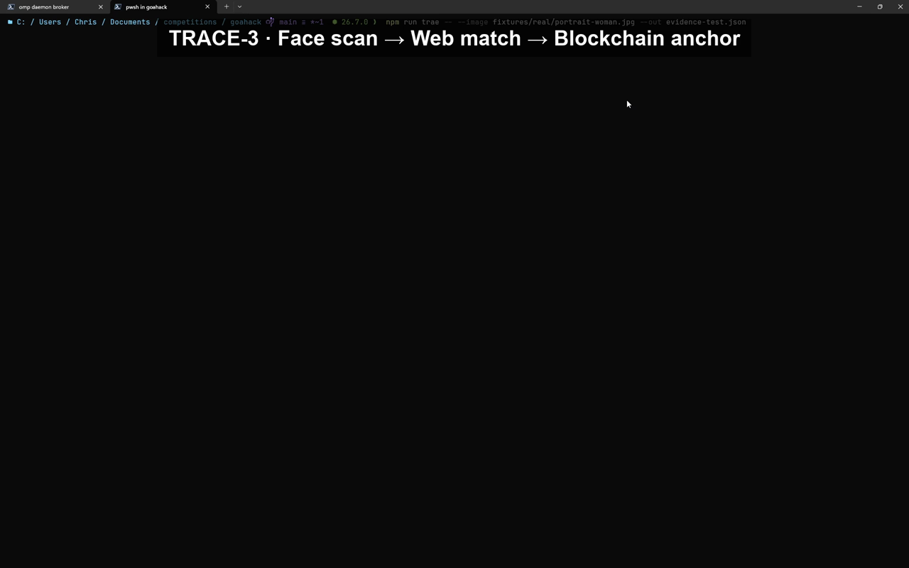

**0:00 — Title.** *"TRACE-3, live. Face scan, web match, blockchain anchor — in under two
minutes."* Sets the contract with the viewer: everything that follows is a real execution, not
slides. The pipeline is already running in the terminal behind the card.


**0:11 — The candidate.** *"Our confirmed match at zero point nine nine two similarity, face box
overlaid."* The matching post's portrait fills the browser: same woman in red, yellow dashed
BlazeFace box on the face. This is the measured-matching phase made visible — a human can see *why*
the 0.992 score is believable before any number is quoted.

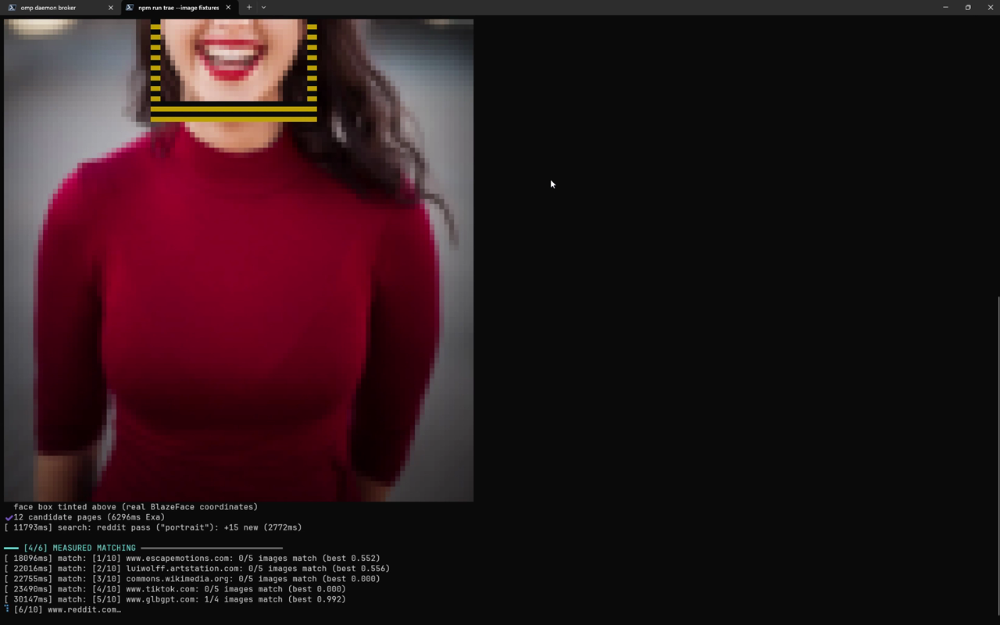

**0:31 — Scrolling the evidence.** *"Checked image by image against the original face scan."* The
matching GlobalGPT post is scrolled top to bottom — mouth crop, chin crop, torso strip — showing the
review wasn't one lucky thumbnail. Per-page similarity logs accumulate below the images as the
26 discovered pages are worked through.

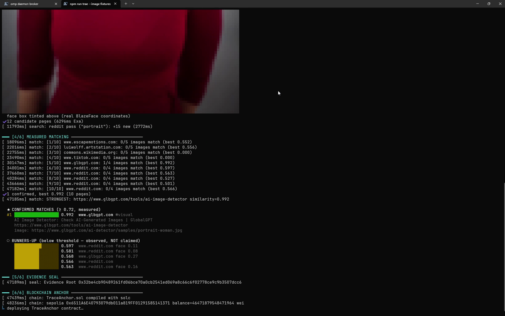

**0:55 — Back in the terminal.** *"The evidence is sealed to a SHA-256 root, and the anchor is
submitted to the Sepolia testnet."* The verdict lines land here: `STRONGEST` match URL + 0.992,
the `0x1313…` Evidence Root, contract deployment (block 11653011) and anchor transaction
(block 11653012). This is the moment raw output becomes a commitment.

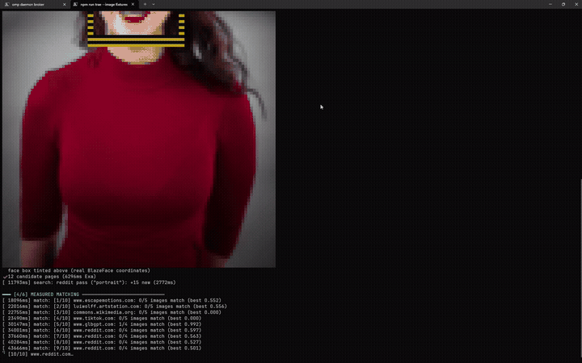

**1:11 — Re-verification.** *"Contract state, event log, and evidence root all agree. Match equals
true."* Phases [5/6] seal and [6/6] anchor close out on screen: `getAnchor`/`verifyAnchor` reads plus
the `EvidenceAnchored` event count. TRACE doesn't trust its own write — it reads the chain back
before declaring success.

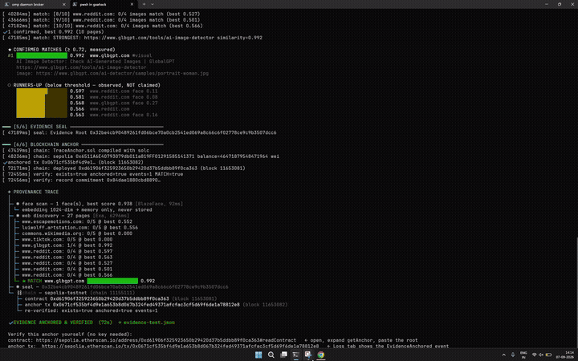

**1:34 — Independent proof.** *"Sepolia Etherscan: Status Success. Evidence anchored and verified."*
The film ends where trust comes from: not our terminal, but Etherscan's Transaction Details page —
`Status: Success`, block 11653012, from our runner address to the `0x2409…` contract. Any judge can
open the same URL and see the same fields; the Logs tab holds the single `EvidenceAnchored` event.

## Reading your results: the evidence file

`evidence/evidence-sepolia.json` (committed sample, match similarity 0.989, `MATCH=true`):

```jsonc
{
  "investigationId": "tr3-mtqmycup-d8e478",
  "input":   { "sha256": "b231e66c…", "face": { "box": {...}, "detectorScore": 0.938 } },
  "matches": [{ "postUrl": "https://choicepsychology.com.au/…",
                "imageUrl": "https://choicepsychology.com.au/…-1170x1755.jpg",
                "similarity": 0.989 }],
  "evidenceRoot": "0x71d6…1dfd54", // abbreviated — full root in evidence/evidence-sepolia.json
  "chain": { "kind": "sepolia-testnet", "chainId": 11155111,
             "contractAddress": "0x122350c73ff0a63a1d7271a411040cc79417feab",
             "anchorTx": "0x8001…8a79b9", // abbreviated — full hash in evidence/evidence-sepolia.json
             "verification": { "exists": true, "anchored": true, "eventCount": 1, "match": true } }
}
```

Words you'll see, precisely defined: **Source Confidence** (how strong the best observed source is —
never a "truth score") · **Evidence Root** (the `0x…` SHA-256 seal) · face similarity is *evidence*,
never *identity*.

---

## Which blockchain?

| Mode | Command | What happens | Good for |
|------|---------|--------------|----------|
| `local` (default) | `--chain local` (or omit) | Spins up ganache (chain 1337), deploys + anchors for real, throws it away after | Zero-setup runs, CI, no funds needed |
| `sepolia` | `--chain sepolia` | Deploys `TraceAnchor.sol` to Ethereum Sepolia (chain 11155111) via `SEPOLIA_RPC_URL`, anchors, re-verifies | Public, checkable-by-anyone anchors |

Only `{evidenceRoot, investigationIdHash, schemaVersion, appVersion}` ever goes on-chain — no images,
no embeddings, no personal data (enforced by `assertChainSafe`). RPC URLs are redacted in evidence files.

**Live Sepolia anchors** (both re-verifiable right now, no key needed):

- **7 Sept 2026 (latest, browser-verified: Status Success, block 11653012, 49 confirmations, 1 `EvidenceAnchored` log):**
  contract [`0x2409511ac5650ac3ff620dd0dc1345d658ee4401`](https://sepolia.etherscan.io/address/0x2409511ac5650ac3ff620dd0dc1345d658ee4401#readContract) ·
  anchor tx [`0xafc9eba879124bd85e298a768ba12f8470ede441970db803879e93b8a68cab27`](https://sepolia.etherscan.io/tx/0xafc9eba879124bd85e298a768ba12f8470ede441970db803879e93b8a68cab27) ·
  root `0x1313…5e729f` (full root in the run output above)
- **7 Sept 2026 (committed sample, `evidence/evidence-sepolia.json`):**
  contract [`0x122350c73ff0a63a1d7271a411040cc79417feab`](https://sepolia.etherscan.io/address/0x122350c73ff0a63a1d7271a411040cc79417feab#readContract) ·
  anchor tx [`0x8001582f24e40b02fc58d31a3bf166cdacd231c9d345b62ecbdd31e9698a79b9`](https://sepolia.etherscan.io/tx/0x8001582f24e40b02fc58d31a3bf166cdacd231c9d345b62ecbdd31e9698a79b9)

Three ways to re-verify (strongest first):

1. `node scripts/verify-evidence.mjs --evidence evidence/evidence-sepolia.json --onchain`
   — recomputes the root *and* re-reads live chain state (`exists/anchored/events/idHash`).
2. Open the contract link → **Contract → Read Contract → `getAnchor`** → paste the Evidence Root →
   `exists=true` (plus `verifyAnchor` with the stored id hash → `true`).
3. Open the anchor-tx link → **Logs** tab → one `EvidenceAnchored` event carrying your root.

> Fresh anchors (< ~5 min old) may show *"unable to locate this TxnHash"* on Etherscan — its indexer
> lags new blocks. Wait a few minutes and hard-refresh; the `--onchain` check reads the chain
> directly and is unaffected. Always confirm you're on `sepolia.etherscan.io`, not mainnet.

Fund the runner address with Sepolia ETH first ([sepoliafaucet.com](https://sepoliafaucet.com) or
[sepolia-faucet.pk910.de](https://sepolia-faucet.pk910.de)); with an empty wallet the pipeline stops
honestly with `chain-no-funds`. Sepolia is a testnet with a finite life — for a permanent anchor,
point the same contract at mainnet.

---

## What TRACE refuses to do (honesty rules)

- **No match, no story.** Below every threshold → exit 1, never a padded result.
- **Observations ≠ inferences.** Stored, ranked, and rendered separately; the UI labels each.
- **Same-name strangers are never merged.** Identity-chain avatars must pass face verification.
- **Privacy by construction.** Embeddings/pixels never enter bundles or chain payloads; secrets live
  only in `.env` (gitignored, never logged — run `npm run scan:secrets` to prove it).
- **Broken legs degrade loudly.** Provider/chain outages → `PARTIAL` with coded errors
  (`private-target`, `rate-limit`, `chain-no-funds`…), never fake success.

---

<details>
<summary>📁 <b>Project map</b> — click to expand</summary>

| Path | What lives there |
|------|------------------|
| `scripts/trace-pipeline.mjs` | Live CLI entry (6 phases) |
| `scripts/verify-evidence.mjs` | Offline / tamper-lab / `--onchain` verifier |
| `scripts/lib/` | `mp-faces` (BlazeFace+MobileNet via headless Chromium) · `exa-search` · `page-images` (SSRF gate + matcher) · `local-chain` (ganache/solc/viem + Sepolia) · `github-resolve` · `reddit-search` · `identity-chain` · `show`/`ascii` (terminal UI) |
| `packages/shared/src/` | 19 typed modules: `types` `canonical` `image` `fingerprint` `face` `providers` `scoring` `provenance` `claims` `bundle` `chain` `pipeline` `store` `demo` … |
| `apps/web/` | Bonus forensic workstation (demo mode): pages + API routes + PeelImage/SimilarityLens/Constellation/TemporalTrace/TraceSeal components |
| `contracts/TraceAnchor.sol` | `anchorEvidence` / `getAnchor` / `verifyAnchor` + `EvidenceAnchored` event |
| `fixtures/` | `real/` Unsplash portraits (freely usable) + synthetic hash-test images; `models/` BlazeFace + MobileNet `.tflite` |
| `evidence/` | Committed sample runs (`evidence-sepolia.json` …) |
| `docs/` | ARCHITECTURE · API · SECURITY · PRIVACY · TESTING · LIMITATIONS · DEMO (+ `images/` screenshots) |
</details>


---

## Configuration

| Variable | Required | Used for |
|----------|----------|----------|
| `EXA_API_KEY` | yes (pipeline) | Live web discovery + page evidence |
| `SEPOLIA_PRIVATE_KEY` | yes (Sepolia mode) | Anchor signing; auto-selects Sepolia when present |
| `SEPOLIA_RPC_URL` | no | Overrides the default public endpoint |
| `TRACE_MODE` | no | `demo` (web default) · `live` · `test` |
| `REVERSE_SEARCH_PROVIDER` | no | Live web provider (`tineye`, default) |

Requires Node 20+ (CI runs 22), npm 11 workspaces. Gates in order:
`gen:fixtures` → build `@trace/shared` → `typecheck` → `test` (56 tests, both workspaces) →
`scan:secrets` → web build → `verify-evidence [--onchain]`.

---

## Known limitations (short version — full text in `docs/LIMITATIONS.md`)

- Discovery depends on Exa's index; obscure images may yield no candidates (then: honest stop).
- Scripted Lens/Bing uploads are bot-walled from this network — probes kept in `scripts/*-probe.mjs`
  as evidence of the attempt.
- Local chain is ephemeral per run; use a persistent testnet for durable anchors.
- Face calibration is small-N engineering notes, not a biometric claim: same-face cosine ≈0.88,
  strangers ≈0.41, threshold 0.75; BlazeFace gate ≥0.3, face-verify needs score ≥0.5 and crop ≥16 px;
  MobileNetV3 is a general embedder, not ArcFace-grade.
- ganache's optional native WebSocket binary has no win32 build for Node ≥21 (upstream archived) —
  TRACE loads ganache lazily and scrubs only that loader notice; execution uses the equivalent
  pure-Node path.

---

## Credits

- Terminal UI: `figlet` + `chalk` + `ora` (MIT). Every animated/persisted number is measured at
  runtime; spinners show live state only, never synthetic progress.
- ASCII preview rendered in-repo from decoded pixels (standard luminance-ramp / half-block truecolor
  in the spirit of `timg`, `chafa`, `pixterm` — original implementation). Decoders: `jpeg-js` + `pngjs`
  (MIT). Rejected on evidence: `image-to-ascii`/`img-to-ascii` (native `lwip2`), `ascii-art` (native
  `canvas`), `console-image` (browser-only).
- Vision models: MediaPipe BlazeFace + MobileNetV3 (`.tflite` in `models/`).
- Chain: `ganache` + `solc` + `viem`; contract targets Sepolia testnet, EVM version Paris.

---

<div align="center">

<sub>TRACE-3 · HH Goa 2026 · evidence, not truth · <a href="#readme">back to top ↑</a></sub>
</div>
